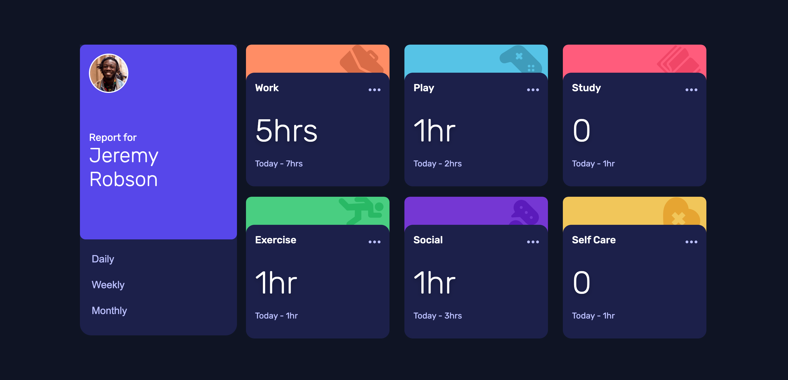

# Frontend Mentor - Time tracking dashboard solution

This is a solution to the [Time tracking dashboard challenge on Frontend Mentor](https://www.frontendmentor.io/challenges/time-tracking-dashboard-UIQ7167Jw). Frontend Mentor challenges help you improve your coding skills by building realistic projects. 

## Table of contents

- [Overview](#overview)
  - [The challenge](#the-challenge)
  - [Screenshot](#screenshot)
  - [Links](#links)
- [My process](#my-process)
  - [Built with](#built-with)
  - [What I learned](#what-i-learned)
  - [Continued development](#continued-development)
  - [Useful resources](#useful-resources)
- [Author](#author)
- [Acknowledgments](#acknowledgments)


## Overview

### The challenge

Users should be able to:

- View the optimal layout for the site depending on their device's screen size
- See hover states for all interactive elements on the page
- Switch between viewing Daily, Weekly, and Monthly stats

### Screenshot





### Links

- Solution URL: [Add solution URL here](https://your-solution-url.com)
- Live Site URL: [Time Tracking App](https://deleonroselle21.github.io/Time-Tracking-App/)

## My process


Here is the solution that ive made to develop this challenge. 
 
The challenge was  to switch between daily, weekly, and monthly. This was addressed by creating a usestate  that will hold the value of the selected timeframe and then passing this value to the cardcomponent that will create the card for each object . 

Using event.target.name i was able to get the name of the selected element and used this to update the time variable and switch between daily, weekly, and monthly. 

```js
const [time,setTime]=React.useState("daily");
    const [previousTime,setPreviousTime]=React.useState("Today");
```
```js

function handleChange(event){
        if(event.target.name==="weekly"){
           setTime("weekly")
           setPreviousTime("Last Week")
        }

        if(event.target.name==="daily")
        {
           setTime("daily");
           setPreviousTime("Today");
        }
        
        if(event.target.name==="monthly")
        {
           setTime("monthly");
           setPreviousTime("Last Month");
         }
 
    }
```

### Built with

- Semantic HTML5 markup
- CSS custom properties
- Flexbox
- CSS Grid
- Mobile-first workflow
- [React](https://reactjs.org/) - JS library


### What I learned
In doing this challenge, I learned how to create and a mobile responsive website using flex and grid with React framework


